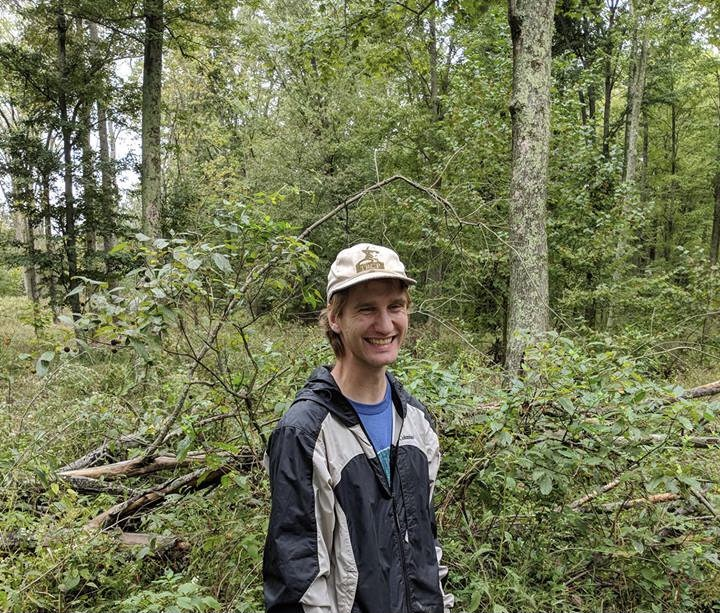

 
I am a PhD student in the Department of Ecology, Evolution and Behavior at the University of Minnesota. I received a B.S. in Ecology and Environmental Biology from the University of Wisconsin Eau-Claire, and an M.S. in Biology from New Mexico State University. I then spent several years working as a field technician in various locations, including monitoring vegetation change in the Chihuahuan Desert, sampling mammal and invertebrate populations in northern Wisconsin, and surveying ticks and mosquitoes in southern Indiana. I am interested in movement ecology and wildlife disease dynamics, particularly at fine spatial scales. Outside of ecology research, I enjoy drinking a tall glass of water in the morning, playing guitar, listening to music, reading, and jogging. 
  
  
  
  

